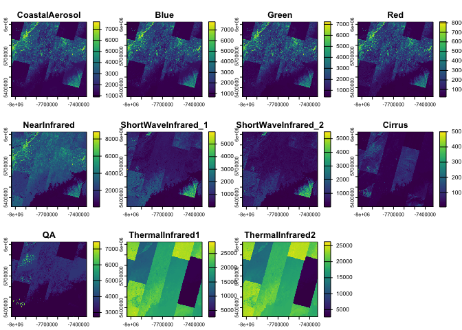

<!-- README.md is generated from README.Rmd. Please edit that file -->

# arcgislayers 

<!-- badges: start -->

[](https://opensource.org/license/apache-2-0)
[](https://github.com/R-ArcGIS/arcgislayers/actions/workflows/R-CMD-check.yaml)
[](https://lifecycle.r-lib.org/articles/stages.html#stable)
[](https://cran.r-project.org/package=arcgislayers)
<!-- badges: end -->

`{arcgislayers}` is the core data access package in the R-ArcGIS Bridge,
providing a unified interface for working with ArcGIS data services. As
part of the `{arcgis}` metapackage, it enables seamless integration
between R and the ArcGIS Web GIS ecosystem, including ArcGIS Online,
Enterprise, and Location Platform.

## Capabilities

- **Connect to any ArcGIS Data Service**: Access feature services,
  imagery, and portal items from ArcGIS Online, Enterprise and Location
  Platform using familiar R objects from `sf` and `terra`.
- **Publish your R objects**: Turn analysis outputs into live ArcGIS
  services that others can access, visualize, modify, and use in their
  workflows.
- **Modify data in place**: Maintain your production datasets—update,
  add, or delete features in feature services directly from R.
- **Attachments**: query, download, and update attachments in feature
  services created by Survey123.

## Installation

`{arcgislayers}` is part of the `{arcgis}` metapackage, which provides
the complete R-ArcGIS Bridge toolkit. For most users, installing the
metapackage is recommended:

``` r
install.packages("arcgis")
```

You can also install `{arcgislayers}` individually from CRAN:

``` r
install.packages("arcgislayers")
```

To install the development version:

``` r
pak::pak("r-arcgis/arcgislayers")
```

## Usage

The basic workflow is: **connect** ➡️ **query** ➡️ **analyze** ➡️
**publish**. Here’s how to get started:

``` r
library(arcgis)
```

### Connect to ArcGIS Data Services

`arc_open()` connects to any ArcGIS data service using its URL or item
ID. This creates a connection to the remote data without downloading
anything yet.

``` r
# Connect to a feature service
furl <- "https://services.arcgis.com/P3ePLMYs2RVChkJx/ArcGIS/rest/services/USA_Counties_Generalized_Boundaries/FeatureServer/0"

county_fl <- arc_open(furl)
county_fl
#> <FeatureLayer>
#> Name: USA Counties - Generalized
#> Geometry Type: esriGeometryPolygon
#> CRS: 4326
#> Capabilities: Query,Extract
```

### Query Data

`arc_select()` brings data from ArcGIS into R as familiar `sf` objects.
You can get everything, or be selective:

``` r
# Get all data (use with caution on large datasets!)
counties_all <- arc_select(county_fl)

# Get specific columns and rows
large_counties <- arc_select(
  county_fl,
  fields = c("state_abbr", "population"),
  where = "population > 1000000"
)

large_counties
#> Simple feature collection with 49 features and 2 fields
#> Geometry type: POLYGON
#> Dimension:     XY
#> Bounding box:  xmin: -158.2674 ymin: 21.24986 xmax: -71.02671 ymax: 47.77552
#> Geodetic CRS:  WGS 84
#> First 10 features:
#>    STATE_ABBR POPULATION                       geometry
#> 1          OH    1264817 POLYGON ((-81.37707 41.3463...
#> 2          OH    1323807 POLYGON ((-83.24282 39.8044...
#> 3          PA    1250578 POLYGON ((-79.86399 40.2007...
#> 4          PA    1603797 POLYGON ((-75.1429 39.8816,...
#> 5          HI    1016508 POLYGON ((-157.6733 21.2980...
#> 6          IL    5275541 POLYGON ((-88.26711 41.9887...
#> 7          AZ    4420568 POLYGON ((-111.0425 33.4759...
#> 8          AZ    1043433 POLYGON ((-110.4522 31.7360...
#> 9          CA    1682353 POLYGON ((-121.4721 37.4777...
#> 10         CA    1165927 POLYGON ((-122.3076 37.8917...
```

### Spatial and Attribute Filtering

Filter by location or attributes before bringing data into R:

``` r
# Spatial filter: get counties that intersect with North Carolina
nc <- sf::st_read(system.file("shape/nc.shp", package="sf"))
#> Reading layer `nc' from data source 
#>   `/Users/josiahparry/Library/R/arm64/4.5/library/sf/shape/nc.shp' 
#>   using driver `ESRI Shapefile'
#> Simple feature collection with 100 features and 14 fields
#> Geometry type: MULTIPOLYGON
#> Dimension:     XY
#> Bounding box:  xmin: -84.32385 ymin: 33.88199 xmax: -75.45698 ymax: 36.58965
#> Geodetic CRS:  NAD27

nc_area_counties <- arc_select(
  county_fl,
  filter_geom = sf::st_bbox(nc[1,])
)

nc_area_counties
#> Simple feature collection with 6 features and 12 fields
#> Geometry type: POLYGON
#> Dimension:     XY
#> Bounding box:  xmin: -82.0477 ymin: 35.98946 xmax: -80.83795 ymax: 36.80746
#> Geodetic CRS:  WGS 84
#>   OBJECTID             NAME     STATE_NAME STATE_FIPS  FIPS     SQMI POPULATION
#> 1      467   Johnson County      Tennessee         47 47091 302.6644      17948
#> 2     1924 Alleghany County North Carolina         37 37005 236.1822      10888
#> 3     1926      Ashe County North Carolina         37 37009 429.3538      26577
#> 4     2016   Watauga County North Carolina         37 37189 313.3604      54086
#> 5     2018    Wilkes County North Carolina         37 37193 756.5252      65969
#> 6     2995   Grayson County       Virginia         51 51077 445.7267      15333
#>   POP_SQMI STATE_ABBR COUNTY_FIPS Shape__Area Shape__Length
#> 1     59.3         TN         091  0.07960385      1.290607
#> 2     46.1         NC         005  0.06140165      1.231232
#> 3     61.9         NC         009  0.11428581      1.442112
#> 4    172.6         NC         189  0.08142272      1.287674
#> 5     87.2         NC         193  0.19911944      1.984232
#> 6     34.4         VA         077  0.11578917      1.945424
#>                         geometry
#> 1 POLYGON ((-81.74091 36.3919...
#> 2 POLYGON ((-81.2397 36.36549...
#> 3 POLYGON ((-81.47258 36.2344...
#> 4 POLYGON ((-81.80605 36.1046...
#> 5 POLYGON ((-81.02037 36.0350...
#> 6 POLYGON ((-81.34512 36.5729...
```

Use `list_fields()` to explore available attributes:

``` r
list_fields(county_fl)
#> # A data frame: 12 × 10
#>    name  type  alias sqlType nullable editable domain defaultValue length description
#>  * <chr> <chr> <chr> <chr>   <lgl>    <lgl>    <lgl>  <lgl>         <int> <chr>      
#>  1 OBJE… esri… OBJE… sqlTyp… FALSE    FALSE    NA     NA               NA  <NA>      
#>  2 NAME  esri… Name  sqlTyp… TRUE     TRUE     NA     NA               50 "{\"value\…
#>  3 STAT… esri… Stat… sqlTyp… TRUE     TRUE     NA     NA               20 "{\"value\…
#>  4 STAT… esri… Stat… sqlTyp… TRUE     TRUE     NA     NA                2 "{\"value\…
#>  5 FIPS  esri… FIPS  sqlTyp… TRUE     TRUE     NA     NA                5 "{\"value\…
#>  6 SQMI  esri… Area… sqlTyp… TRUE     TRUE     NA     NA               NA "{\"value\…
#>  7 POPU… esri… 2020… sqlTyp… TRUE     TRUE     NA     NA               NA "{\"value\…
#>  8 POP_… esri… Peop… sqlTyp… TRUE     TRUE     NA     NA               NA "{\"value\…
#>  9 STAT… esri… Stat… sqlTyp… TRUE     TRUE     NA     NA                2 "{\"value\…
#> 10 COUN… esri… Coun… sqlTyp… TRUE     TRUE     NA     NA                3 "{\"value\…
#> 11 Shap… esri… Shap… sqlTyp… TRUE     FALSE    NA     NA               NA  <NA>      
#> 12 Shap… esri… Shap… sqlTyp… TRUE     FALSE    NA     NA               NA  <NA>
```

### Work with Imagery

`arc_raster()` extracts raster data from ArcGIS ImageServers as `terra`
objects:

``` r
# Connect to Landsat imagery
img_url <- "https://landsat2.arcgis.com/arcgis/rest/services/Landsat/MS/ImageServer"
landsat <- arc_open(img_url)

# Extract imagery for a specific area
res <- arc_raster(
  landsat, 
  xmin = -71, 
  ymin = 43, 
  xmax = -67, 
  ymax = 47.5, 
  bbox_crs = 4326, 
  width = 500,
  height = 500
)

terra::plot(res)
```



### Publish Your Results

Turn your R analysis into ArcGIS services that others can access:

``` r
# Publish an sf object as a feature service (requires authentication)
my_analysis <- large_counties |>
  dplyr::mutate(density_category = ifelse(pop_sqmi > 100, "Dense", "Sparse"))

publish_layer(
  my_analysis,
  title = "County Population Density Analysis",
  description = "Counties categorized by population density"
)
```

## Learn more

To learn more about about how to most effectively use `{arcgislayers}`
for your use case review the [developer site
documentation](https://developers.arcgis.com/r-bridge).

- [Authentication](https://developers.arcgis.com/r-bridge/authentication/)
- [Publishing
  Layers](https://developers.arcgis.com/r-bridge/layers/publishing/)
- [Editing Feature
  Services](https://developers.arcgis.com/r-bridge/editing/editing-overview/)
- [Geocoding](https://developers.arcgis.com/r-bridge/geocoding/overview/)
