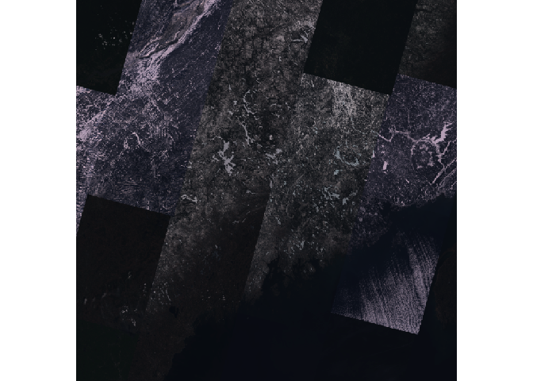

<!-- README.md is generated from README.Rmd. Please edit that file -->

# arcgis

<!-- badges: start -->
<!-- badges: end -->

The goal of `{arcgis}` is to provide an R interface to the ArcGIS REST
API

## Installation

You can install the development version of arcgis like so:

``` r
remotes::install_github("R-ArcGIS/api-interface")
```

## Basic functionality

- `arc_open()` creates a reference to a dataset will return 1 of 4 types
  of objects:
  - `FeatureLayer`
  - `Table`
  - `FeatureServer`
  - `ImageServer`

Create a `FeatureLayer` object.

``` r
library(arcgis)

# define the feature layer url
furl <- "https://services.arcgis.com/P3ePLMYs2RVChkJx/ArcGIS/rest/services/USA_Counties_Generalized_Boundaries/FeatureServer/0"

county_fl <- arc_open(furl)

county_fl
#> <FeatureLayer <3143 features, 12 fields>>
#> Name: USA Counties - Generalized
#> Geometry Type: esriGeometryPolygon
#> CRS: 4326
#> Capabilities: Query,Extract
```

Query the feature layer object and return an `sf` object using
`arc_select()`. If no arguments are provided to `arc_select()` the
entire feature layer is returned in memory as an `sf` object.

Utilize the `fields` and `where` arguments to return a subset of columns
and rows respectively.

- `fields` takes a character vector of column names
- `where` takes a simple SQL where clause

Return counties with population greater than 1,000,000.

``` r
arc_select(
  county_fl, 
  fields = c("state_abbr", "population"), 
  where = "population > 1000000"
)
#> Simple feature collection with 49 features and 2 fields
#> Geometry type: MULTIPOLYGON
#> Dimension:     XY
#> Bounding box:  xmin: -158.2674 ymin: 21.24986 xmax: -71.02671 ymax: 47.77552
#> Geodetic CRS:  WGS 84
#> First 10 features:
#>    STATE_ABBR POPULATION                       geometry
#> 1          AZ    4420568 MULTIPOLYGON (((-111.0425 3...
#> 2          AZ    1043433 MULTIPOLYGON (((-110.4522 3...
#> 3          CA    1682353 MULTIPOLYGON (((-121.4721 3...
#> 4          CA    1165927 MULTIPOLYGON (((-122.3076 3...
#> 5          CA    1008654 MULTIPOLYGON (((-120.6636 3...
#> 6          CA   10014009 MULTIPOLYGON (((-118.1067 3...
#> 7          CA    3186989 MULTIPOLYGON (((-117.509 33...
#> 8          CA    2418185 MULTIPOLYGON (((-116.0824 3...
#> 9          CA    1585055 MULTIPOLYGON (((-121.6652 3...
#> 10         CA    2181654 MULTIPOLYGON (((-117.7832 3...
```

Note you can also provide an `sfc`/`sfg` object to the `filter_geom`
argument to perform a spatial filter. Note that this is limited to only
one object. See documentation for more (`?arc_select`).

`SpatRaster` object from the `terra` package can be extracted from an
`ImageServer` by using `arc_raster()`.

`arc_raster()` requires a `bbox` class object from the `sf` package to
define the area to be extracted. Optionally can specify the `width` and
`height` of the resultant image. Use `format` to define what type of
image is returned.

``` r
img_url <- "https://landsat2.arcgis.com/arcgis/rest/services/Landsat/MS/ImageServer"

landsat <- arc_open(img_url)

bbox <- sf::st_bbox(c(xmin = -71, ymin = 43, xmax = -67, ymax = 47.5), crs = 4326)

res <- arc_raster(landsat, bbox, 1000, 1000)

terra::plotRGB(res, 4, 3, 2, scale = max(landsat[["maxValues"]]))
```



------------------------------------------------------------------------

<!-- # DEPRECATED FROM HERE DOWN  -->
<!-- TODO update and rewrite -->
<!-- ## Feature Layers -->
<!-- Read in data from a feature layer. arcgis implements a `FeatureLayer` class object which is used to control how we read data from a Feature Layer service.  -->
<!-- Create a `FeatureLayer` with `feature_layer()` which takes the url of the feature layer as its only argument.  -->
<!-- ```{r example} -->
<!-- library(arcgis) -->
<!-- # define the feature layer url -->
<!-- furl <- "https://services.arcgis.com/P3ePLMYs2RVChkJx/ArcGIS/rest/services/USA_Counties_Generalized_Boundaries/FeatureServer/0" -->
<!-- # create a feature layer -->
<!-- county_fl <- feature_layer(furl) -->
<!-- county_fl -->
<!-- ``` -->
<!-- `FeatureLayer` objects are lists that contain metadata from the FeatureServer. The data that is used to create the `FeatureLayer` is taken directly from the url when displayed in json format. `FeatureLayer`s are intended to work somewhat similarly to a lazy table where data is only brought into memory when explicitly requested.  -->
<!-- The `collect_layer()` function will fetch all data for a layer from the REST endpoint and write it to the appropriate type—either an sf object or a data frame.  -->
<!-- ```{r cars} -->
<!-- county_sf <- collect_layer(county_fl) -->
<!-- county_sf -->
<!-- ``` -->
<!-- We can check to see what fields and types are present in our feature layer using `list_fields()`.  -->
<!-- ```{r} -->
<!-- list_fields(county_fl) -->
<!-- ``` -->
<!-- You can provide a more detailed query to the layer using `query_layer()`.  -->
<!-- ```{r} -->
<!-- res <- query_layer( -->
<!--   county_fl,  -->
<!--   where = "STATE_NAME = 'California' and POPULATION >= 30000", -->
<!--   fields = c("FIPS", "STATE_NAME", "SQMI", "POPULATION") -->
<!-- ) -->
<!-- res -->
<!-- ``` -->
<!-- Additionally, you can provide sf objects as spatial filters based on a predicate function.  Possible options are "intersects", "contains", "crosses", "overlaps", "touches", and "within". -->
<!-- In this example we create a polygon representing the bounding box of the West Coast of the US to act as our spatial filter.  -->
<!-- ```{r} -->
<!-- west_coast_bbox <- sf::st_as_sfc( -->
<!--   sf::st_bbox(c(xmin = -125, ymin = 32, xmax = -114, ymax = 49)) -->
<!-- ) -->
<!-- west_coast_bbox -->
<!-- ``` -->
<!-- We can then provide it as input to the `filter_geom` argument to act as a spatial filter.  -->
<!-- ```{r} -->
<!-- res <- query_layer( -->
<!--   county_fl,  -->
<!--   filter_geom = west_coast_bbox -->
<!-- ) -->
<!-- plot(res$geometry) -->
<!-- plot(west_coast_bbox, lty = 3, add = TRUE) -->
<!-- ``` -->
<!-- For manual control of the parameters that will be sent to the REST API you can use `update_params()`. This function allows you to built up your query iteratively and programmatically without executing the query right away. Use it in conjunction with `collect_layer()` for a lazy-ish process. -->
<!-- ```{r} -->
<!-- fl_query <- update_params( -->
<!--   county_fl,  -->
<!--   where = "STATE_NAME = 'New Hampshire'", -->
<!--   outFields = "STATE_NAME,POPULATION" -->
<!-- ) -->
<!-- fl_query -->
<!-- ``` -->
<!-- Notice the appended query. You can execute the query and bring the results into memory using `collect_layer()`. -->
<!-- ```{r} -->
<!-- collect_layer(fl_query) -->
<!-- ``` -->
<!-- ## Interfacing with `{arcgisbinding}` -->
<!-- - to do.... -->
<!-- ### dplyr-like syntax -->
<!-- You may not need all of these fields or features in your R session. If that's the case, it is more effective to bring in only a subset of the data that you need. We can limit what is brought into memory by using `select()` and `filter()` functions to build up a query that can be sent the rest API.  -->
<!-- The `select()` `FeatureLayer` method supports using `{tidyselect}` functions except the `where()` function. -->
<!-- ```{r} -->
<!-- county_fl |>  -->
<!--   select(contains("STATE")) -->
<!-- ``` -->
<!-- Now that we've ran `select()` on the `FeatureLayer` query parameters are printed out. The parameters will be sent along when the results are `collect()`ed.  -->
<!-- You can further subset your data by using `filter()`. Note that filtering is fairly limited ([see API documentation for more](https://developers.arcgis.com/rest/services-reference/enterprise/query-feature-service-layer-.htm#GUID-BC2AD141-3386-49FB-AA09-FF341145F614)). -->
<!-- ```{r} -->
<!-- county_query <- county_fl |>  -->
<!--   select(starts_with("STATE")) |>  -->
<!--   filter(STATE_NAME == "Alabama") -->
<!-- county_query -->
<!-- ``` -->
<!-- Bring it into memory with `collect()`. -->
<!-- ```{r} -->
<!-- res <- collect(county_query) -->
<!-- res -->
<!-- ``` -->
<!-- ### Other `FeatureLayer` functions -->
<!-- You can add any parameter that you'd like that is supported by the query parameters [listed in the documentation](https://developers.arcgis.com/rest/services-reference/enterprise/query-feature-service-layer-.htm#GUID-BC2AD141-3386-49FB-AA09-FF341145F614) with the using the `update_params()` function. -->
<!-- ```{r} -->
<!-- county_query |>  -->
<!--   update_params(returnIdsOnly = "true") |>  -->
<!--   collect() -->
<!-- ``` -->
<!-- Maybe, you want to clear our your query parameters, use `clear_query()`. -->
<!-- ```{r} -->
<!-- clear_query(county_query) -->
<!-- ``` -->
<!-- To preview only a few features from the feature layer use `head()` -->
<!-- ```{r} -->
<!-- head(county_query) -->
<!-- ``` -->
<!-- ## `FeatureServers` -->
<!-- FeatureServers contain one or more `FeatureLayers` or `Tables`.  -->
<!-- ```{r} -->
<!-- ft_srv <- feature_server( -->
<!--   "https://services2.arcgis.com/j80Jz20at6Bi0thr/ArcGIS/rest/services/List_of_Providers/FeatureServer/" -->
<!--   ) -->
<!-- ft_srv -->
<!-- ``` -->
<!-- Access elements by ID with `get_layer()` -->
<!-- ```{r} -->
<!-- get_layer(ft_srv, 27) -->
<!-- ``` -->
<!-- Get a list of all elements. -->
<!-- ```{r} -->
<!-- get_all_layers(ft_srv) -->
<!-- ``` -->
<!-- ## Conversion to Esri JSON -->
<!-- sf objects can be converted to Esri JSON representation. These can be Geometry Objects, FeatureSets, or arrays of Features.  -->
<!-- `st_as_geometry()` works with objects of class `sfg` and creates a Geometry Object. `st_as_featureset()` creates a FeatureSet from an sf or sfc object. sfc objects will have 0 length attributes. `st_as_features()` works with an sf or sfc object.  -->
<!-- ```{r} -->
<!-- st_as_geometry(res[["geometry"]][[30]]) |>  -->
<!--   # print nicely with jsonify -->
<!--   jsonify::pretty_json() -->
<!-- ``` -->
<!-- ```{r} -->
<!-- st_as_featureset(res[30,]) |>  -->
<!--   jsonify::pretty_json() -->
<!-- ``` -->
