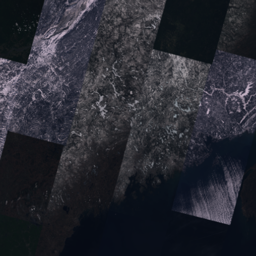

<!-- README.md is generated from README.Rmd. Please edit that file -->


# arcgislayers

<!-- badges: start -->

[](https://opensource.org/license/apache-2-0)
[](https://github.com/R-ArcGIS/arcgislayers/actions/workflows/R-CMD-check.yaml)
[](https://lifecycle.r-lib.org/articles/stages.html#stable)
<!-- badges: end -->

The goal of `{arcgislayers}` is to provide an R interface to the [ArcGIS REST API](https://developers.arcgis.com/rest/) .

## Installation

It is recommend you install and use the metapackage `{arcgis}`. You can install the development version of arcgis like so:

``` r
remotes::install_github("r-arcgis/arcgis", dependencies = TRUE)
```

## Usage

### Creating a simple feature object from an ArcGIS FeatureLayer


```r
library(arcgis)
```

`arc_open()` takes a URL to create a reference to a remote ArcGIS layer, server, or table. The function can return any of the following classes (corresponding to different ArcGIS service types):

  - `FeatureLayer`
  - `Table`
  - `FeatureServer`
  - `ImageServer`
  - `MapServer`
  - `GroupLayer`
  
For example, you can create a `FeatureLayer` object based on a Feature Server URL:
  

```r
furl <- "https://services.arcgis.com/P3ePLMYs2RVChkJx/ArcGIS/rest/services/USA_Counties_Generalized_Boundaries/FeatureServer/0"

county_fl <- arc_open(furl)

county_fl
#> <FeatureLayer>
#> Name: USA Counties - Generalized
#> Geometry Type: esriGeometryPolygon
#> CRS: 4326
#> Capabilities: Query,Extract
```

You can then use `arc_select()` to query the feature layer object and return an `sf` object.

If no arguments are provided to `arc_select()` the entire feature layer is returned in memory as an `sf` object. 


```r
arc_select(county_fl)
#> 
Iterating ■■■■■■■■■■■■■■■■ 50% | ETA: 1s

#> Simple feature collection with 3143 features and 12 fields
#> Geometry type: MULTIPOLYGON
#> Dimension:     XY
#> Bounding box:  xmin: -178.2176 ymin: 18.92179 xmax: -66.96927 ymax: 71.40624
#> Geodetic CRS:  WGS 84
#> First 10 features:
#>    OBJECTID            NAME STATE_NAME STATE_FIPS  FIPS    SQMI POPULATION POP_SQMI
#> 1         1  Autauga County    Alabama         01 01001  604.37      58805     97.3
#> 2         2  Baldwin County    Alabama         01 01003 1633.14     231767    141.9
#> 3         3  Barbour County    Alabama         01 01005  904.52      25223     27.9
#> 4         4     Bibb County    Alabama         01 01007  626.17      22293     35.6
#> 5         5   Blount County    Alabama         01 01009  650.63      59134     90.9
#> 6         6  Bullock County    Alabama         01 01011  625.14      10357     16.6
#> 7         7   Butler County    Alabama         01 01013  777.88      19051     24.5
#> 8         8  Calhoun County    Alabama         01 01015  612.27     116441    190.2
#> 9         9 Chambers County    Alabama         01 01017  603.11      34772     57.7
#> 10       10 Cherokee County    Alabama         01 01019  599.98      24971     41.6
#>    STATE_ABBR COUNTY_FIPS Shape__Area Shape__Length                       geometry
#> 1          AL         001   0.1489034      1.884137 MULTIPOLYGON (((-86.82067 3...
#> 2          AL         003   0.4044891      3.678276 MULTIPOLYGON (((-87.97309 3...
#> 3          AL         005   0.2224307      2.218514 MULTIPOLYGON (((-85.74337 3...
#> 4          AL         007   0.1577359      1.852453 MULTIPOLYGON (((-87.41986 3...
#> 5          AL         009   0.1675296      2.067456 MULTIPOLYGON (((-86.96799 3...
#> 6          AL         011   0.1557273      2.006250 MULTIPOLYGON (((-85.4114 32...
#> 7          AL         013   0.1927305      1.769462 MULTIPOLYGON (((-86.44912 3...
#> 8          AL         015   0.1523369      2.149825 MULTIPOLYGON (((-85.79353 3...
#> 9          AL         017   0.1531136      1.637226 MULTIPOLYGON (((-85.58963 3...
#> 10         AL         019   0.1527217      1.794142 MULTIPOLYGON (((-85.41657 3...
```
### Filtering using `where` or `filter_geom` arguments 

You can also use the `fields` argument to select columns or the `where` argument to subset rows.

For example, using a character vector of column names for `fields` and a simple SQL where clause for  `where` you can select counties with population greater than 1,000,000:


```r
arc_select(
  county_fl, 
  fields = c("state_abbr", "population"), 
  where = "population > 1000000"
)
#> Simple feature collection with 49 features and 3 fields
#> Geometry type: MULTIPOLYGON
#> Dimension:     XY
#> Bounding box:  xmin: -158.2674 ymin: 21.24986 xmax: -71.02671 ymax: 47.77552
#> Geodetic CRS:  WGS 84
#> First 10 features:
#>    STATE_ABBR POPULATION OBJECTID                       geometry
#> 1          AZ    4420568      101 MULTIPOLYGON (((-111.0425 3...
#> 2          AZ    1043433      104 MULTIPOLYGON (((-110.4522 3...
#> 3          CA    1682353      184 MULTIPOLYGON (((-121.4721 3...
#> 4          CA    1165927      190 MULTIPOLYGON (((-122.3076 3...
#> 5          CA    1008654      193 MULTIPOLYGON (((-120.6636 3...
#> 6          CA   10014009      202 MULTIPOLYGON (((-118.1067 3...
#> 7          CA    3186989      213 MULTIPOLYGON (((-117.509 33...
#> 8          CA    2418185      216 MULTIPOLYGON (((-116.0824 3...
#> 9          CA    1585055      217 MULTIPOLYGON (((-121.6652 3...
#> 10         CA    2181654      219 MULTIPOLYGON (((-117.7832 3...
```

For `FeatureLayer` and `Table` objects, and sometimes `ImageServer`s, the `list_fields()` function can be helpful to check available attributes and build a `where` query:


```r
list_fields(county_fl)
#>             name                 type                  alias       sqlType nullable
#> 1       OBJECTID     esriFieldTypeOID               OBJECTID  sqlTypeOther    FALSE
#> 2           NAME  esriFieldTypeString                   Name  sqlTypeOther     TRUE
#> 3     STATE_NAME  esriFieldTypeString             State Name  sqlTypeOther     TRUE
#> 4     STATE_FIPS  esriFieldTypeString             State FIPS  sqlTypeOther     TRUE
#> 5           FIPS  esriFieldTypeString                   FIPS  sqlTypeOther     TRUE
#> 6           SQMI  esriFieldTypeDouble   Area in square miles  sqlTypeOther     TRUE
#> 7     POPULATION esriFieldTypeInteger  2020 Total Population  sqlTypeOther     TRUE
#> 8       POP_SQMI  esriFieldTypeDouble People per square mile  sqlTypeOther     TRUE
#> 9     STATE_ABBR  esriFieldTypeString     State Abbreviation  sqlTypeOther     TRUE
#> 10   COUNTY_FIPS  esriFieldTypeString            County FIPS  sqlTypeOther     TRUE
#> 11   Shape__Area  esriFieldTypeDouble            Shape__Area sqlTypeDouble     TRUE
#> 12 Shape__Length  esriFieldTypeDouble          Shape__Length sqlTypeDouble     TRUE
#>    editable domain defaultValue length
#> 1     FALSE     NA           NA     NA
#> 2      TRUE     NA           NA     50
#> 3      TRUE     NA           NA     20
#> 4      TRUE     NA           NA      2
#> 5      TRUE     NA           NA      5
#> 6      TRUE     NA           NA     NA
#> 7      TRUE     NA           NA     NA
#> 8      TRUE     NA           NA     NA
#> 9      TRUE     NA           NA      2
#> 10     TRUE     NA           NA      3
#> 11    FALSE     NA           NA     NA
#> 12    FALSE     NA           NA     NA
#>                                                                                                                                                                                                                 description
#> 1                                                                                                                                                                                                                      <NA>
#> 2                                                                                                                                                        {"value":"The name of the county.","fieldValueType":"nameOrTitle"}
#> 3                                                                                                                         {"value":"The name for the state in which the county is located.","fieldValueType":"nameOrTitle"}
#> 4                                                                                                 {"value":"The code (two-digit number) for the state in which the county is located.","fieldValueType":"uniqueIdentifier"}
#> 5  {"value":"The combined state and county codes. County codes begin with 001 for each state; use the combined code (five-digit number) to uniquely identify a county in the country.","fieldValueType":"uniqueIdentifier"}
#> 6                                                                             {"value":"The area of the county in square miles using the North America Albers Equal Area Conic projection.","fieldValueType":"measurement"}
#> 7                                                                                                                                           {"value":"The 2020 population of the county.","fieldValueType":"countOrAmount"}
#> 8                                                                                                                             {"value":"The 2020 population of the county per square mile.","fieldValueType":"measurement"}
#> 9                                                                                                 {"value":"The two-letter abbreviation for the state in which the county is located.","fieldValueType":"uniqueIdentifier"}
#> 10                                                                                                                            {"value":"The code (three-digit number) for the county.","fieldValueType":"uniqueIdentifier"}
#> 11                                                                                                                                                                                                                     <NA>
#> 12                                                                                                                                                                                                                     <NA>
```

You can also provide a `bbox`, `sfc`, or `sfg` object to the `filter_geom` argument to perform a spatial filter. If the `sfc` object contains more than one geometry, the object is combined with `sf::st_union()`. See documentation for more (`?arc_select`).


```r
nc <- sf::st_read(system.file("shape/nc.shp", package="sf"))
#> Reading layer `nc' from data source 
#>   `C:\Users\mar10556\AppData\Local\R\win-library\4.3\sf\shape\nc.shp' using driver `ESRI Shapefile'
#> Simple feature collection with 100 features and 14 fields
#> Geometry type: MULTIPOLYGON
#> Dimension:     XY
#> Bounding box:  xmin: -84.32385 ymin: 33.88199 xmax: -75.45698 ymax: 36.58965
#> Geodetic CRS:  NAD27

arc_select(
  county_fl,
  filter_geom = sf::st_bbox(nc[1,])
)
#> Simple feature collection with 6 features and 12 fields
#> Geometry type: MULTIPOLYGON
#> Dimension:     XY
#> Bounding box:  xmin: -82.0477 ymin: 35.98946 xmax: -80.83795 ymax: 36.80746
#> Geodetic CRS:  WGS 84
#>   OBJECTID             NAME     STATE_NAME STATE_FIPS  FIPS   SQMI POPULATION POP_SQMI
#> 1     1890 Alleghany County North Carolina         37 37005 236.26      10888     46.1
#> 2     1892      Ashe County North Carolina         37 37009 429.38      26577     61.9
#> 3     1982   Watauga County North Carolina         37 37189 313.32      54086    172.6
#> 4     1984    Wilkes County North Carolina         37 37193 756.33      65969     87.2
#> 5     2471   Johnson County      Tennessee         47 47091 302.69      17948     59.3
#> 6     2855   Grayson County       Virginia         51 51077 445.57      15333     34.4
#>   STATE_ABBR COUNTY_FIPS Shape__Area Shape__Length                       geometry
#> 1         NC         005  0.06140165      1.231232 MULTIPOLYGON (((-81.2397 36...
#> 2         NC         009  0.11428581      1.442112 MULTIPOLYGON (((-81.47258 3...
#> 3         NC         189  0.08142272      1.287674 MULTIPOLYGON (((-81.80605 3...
#> 4         NC         193  0.19911944      1.984232 MULTIPOLYGON (((-81.02037 3...
#> 5         TN         091  0.07960385      1.290607 MULTIPOLYGON (((-81.74091 3...
#> 6         VA         077  0.11578917      1.945424 MULTIPOLYGON (((-81.34512 3...
```

### Creating a `SpatRaster` from an ArcGIS ImageServer

A `SpatRaster` object from the `{terra}` package can be extracted from an `ImageServer` using `arc_raster()`.

`arc_raster()` will extract the area defined by `xmin`, `ymin`, `xmax`, and `ymax`. You can optionally specify the `width` and `height` of the resultant image. Use `format` to define what type of image is returned.


```r
img_url <- "https://landsat2.arcgis.com/arcgis/rest/services/Landsat/MS/ImageServer"

landsat <- arc_open(img_url)

res <- arc_raster(
  landsat, 
  xmin = -71, ymin = 43, 
  xmax = -67, ymax = 47.5, 
  bbox_crs = 4326, 
  width = 500, height = 500
)

terra::plotRGB(res, 4, 3, 2, scale = max(landsat[["maxValues"]]))
```

<div class="figure">

<p class="caption">plot of chunk unnamed-chunk-16</p>
</div>

## Authorization and publication

Authorization is not required for reading data from any public ArcGIS Online or ArcGIS Enterprise service. 

Workflows that require authorization using an ArcGIS Online or ArcGIS Enterprise account include:
 - interacting with [non-public](https://doc.arcgis.com/en/arcgis-online/share-maps/share-items.htm) services
 - publishing a new service (the authorized user must also have [publishing privileges](https://doc.arcgis.com/en/arcgis-online/administer/roles.htm))
 - modifying or deleting any existing service (the authorized user must also have [edit access](https://doc.arcgis.com/en/arcgis-online/manage-data/manage-editing-hfl.htm) to the service)

### Accessing non-public data

The same functions for reading public ArcGIS Online and Enterprise services (such as `arc_open()`,`arc_read()`,`arc_select()`,`arc_raster`, etc.) can be used to read data from non-public services by using the `token` argument.
For more information on tokens and authorization functions, see the [authorization article](https://r.esri.com/r-bridge-site/location-services/connecting-to-a-portal.html).

### Publishing and modifying services from R

The package includes functions to publish data to an ArcGIS Portal:

- `add_item()`: Creates a new FeatureCollection from a `sf` or `data.frame` object
- `publish_item()`: Publishes an existing FeatureLayer
- `publish_layer()`: is a higher level wrapper around both `add_item()` and `publish_item()`

There are also functions to add or modify data including `add_features()`, `update_features()`, and `delete_features()`. For a more detailed guide to adding, updating, and deleting features, view the tutorial on the [R-ArcGIS Bridge website](https://r.esri.com/r-bridge-site/location-services/workflows/add-delete-update.html).

These functions all require authorization since data cannot be published or modified anonymously in ArcGIS Online and ArcGIS Enterprise.
