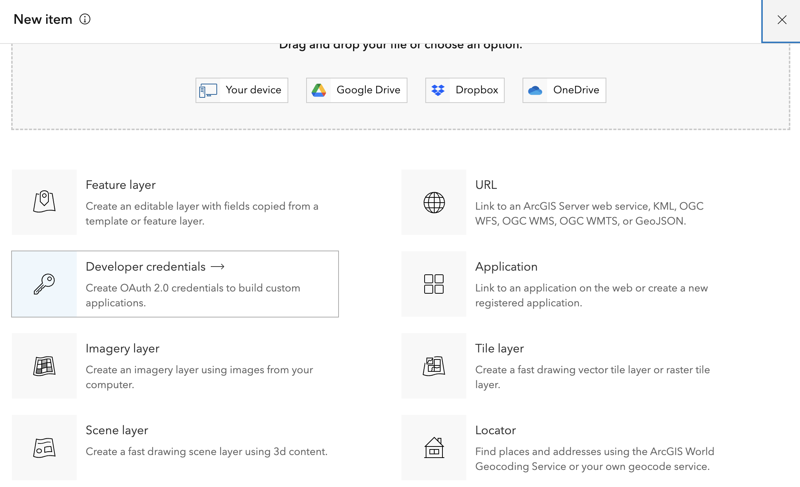
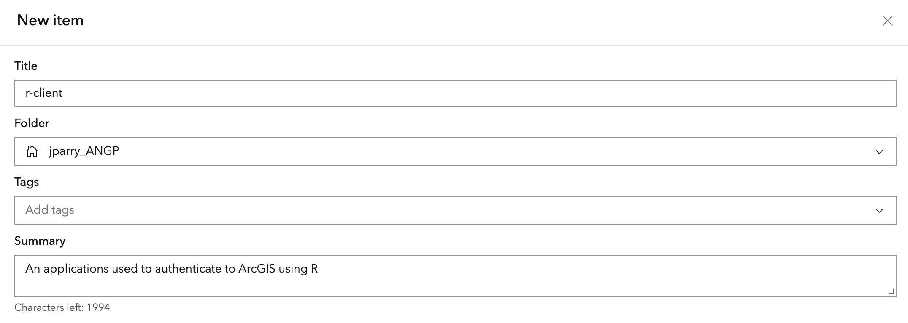
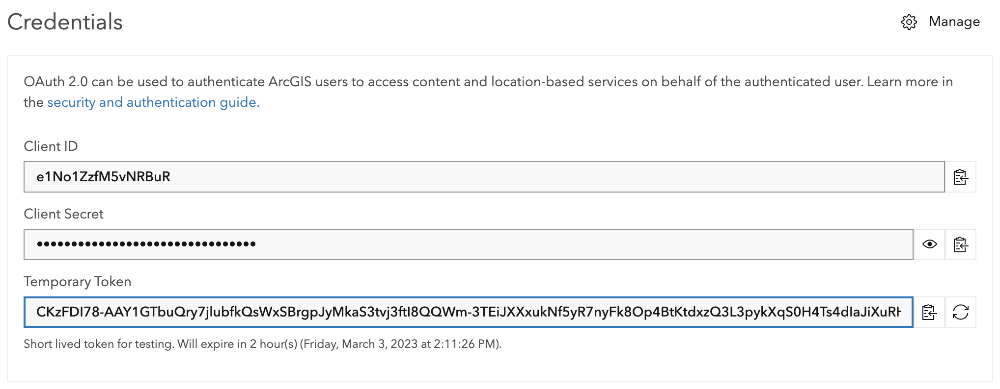
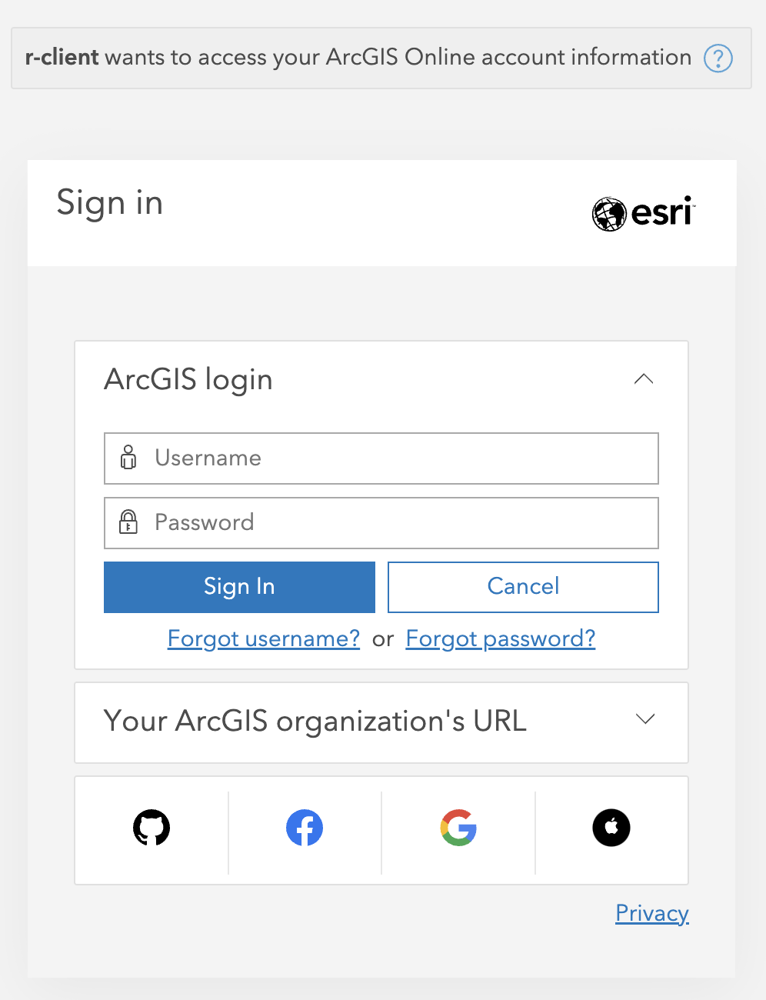
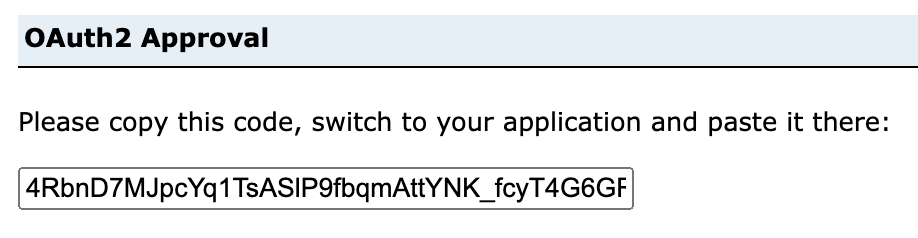

```{r, include = FALSE}
knitr::opts_chunk$set(
  collapse = TRUE,
  comment = "#>"
)
```


Authentication is required for users who wish to access data that is in a non-public ArGIS Online (AGOL) organization, in an ArcGIS Enterprise portal, or wish to upload data to or modify data in AGOL. 

[Authentication is done using OAuth2](https://developers.arcgis.com/documentation/mapping-apis-and-services/security/oauth-2.0/). There are two ways to authenticate with OAuth2: either by using a a `code` or a `client` flow. The recommendation for most people is to utilize code based authentication.

> Tip: use client based authentication for non-interactive work. 

## Code based authentication

To use code based authentication use the `auth_code()` function. This requires a client ID. A [client ID](https://www.oauth.com/oauth2-servers/client-registration/client-id-secret) is a public identifier to an application that you will authenticate against. This is the **only** method of authentication that provides you with a refresh token. 

### Getting the Client ID 

A client ID would likely be provided by an admin of an AGOL organization or ArcGIS Enterprise. In the case that you don't have one you can more than likely create one. To create a client application log into your portal and create a new item. 


Create a new `Developer credentials`




**Ensure the redirect URL is `urn:ietf:wg:oauth:2.0:oob`** and keep the other default selections. Press next and fill out additional fields.



You will be redirected to the content page. You will see credentials for your application. **Do not share these**. 


By default environment variables will be used by `auth_code()`. To edit your environment variables with your newly created credentials use `usethis::edit_r_environ()` which will open an `.Renviron` file for you.

> User level environment variables will be used by default. If you want to use a project level `.Renviron` file use `usethis::edit_r_environ("project")`. 

Add the following lines to your `.Renviron` file. 

```bash
ARCGIS_CLIENT=your-client-id
ARCGIS_SECRET=your-super-secret-key
```

> The `ARCGIS_SECRET` environment variable will only be used in `auth_client()` and not necessary for `auth_code()`. 


### Authenticating 

First, load the library. 

```{r setup}
library(arcgis)
```

Next run `auth_code()` which will open a tab in your browser. If you are authenticating to somewhere other than AGOL, set the `host` argument. 

```{r, eval = FALSE}
token <- auth_code()
```
You will be prompted to sign in to your portal. 

{width=50%}

Once you've signed in, copy the code that appears, and return to R. Enter the code into the console without any modifications and press enter. 

{width=70%}

Your authentication will have completed. 


```{r, eval = FALSE}
token
#> <httr2_token>
#> token_type: bearer
#> access_token: <REDACTED>
#> expires_at: 2023-03-03 13:21:40
#> refresh_token: <REDACTED>
#> username: your-user
#> ssl: TRUE
#> refresh_token_expires_in: 1209599
```

### Refreshing tokens

`auth_code()` tokens can be refreshed. These tokens come with a refresh token that can be exchanged for a new token. This can be done with `refresh_token()`. It requires the original token, client ID, and hostname (which is https://arcgis.com by default).

```{r, eval = FALSE}
refresh_token(token)
#> <httr2_token>
#> token_type: bearer
#> access_token: <REDACTED>
#> expires_at: 2023-03-03 15:52:13
#> username: user-name
#> ssl: TRUE
#> refresh_token: <REDACTED>
```

Additionally the function `validate_or_refresh_token()` is provided. This can be useful if you have a very long running job that may exceed your token's validity. If your token is a expired, it will be refreshed. If it is not expired, and _will not_ expire within the `refresh_threshold`, it will be returned. 


## Client Authentication 

For non-interactive workflows a client OAuth2 flow is more appropriate. This approach does not require you to copy and paste a code from the browser into your R session. This method does not generate a refresh token, though. 

Use `auth_client()` to perform client based authentication. `auth_client()` has a `secret` argument which, by default, uses the environment variable `ARCGIS_SECRET` which was set in your `.Renviron` file above. Running

```{r eval = FALSE}
auth_client()
#> <httr2_token>
#> token_type: bearer
#> access_token: <REDACTED>
#> expires_at: 2023-03-03 17:12:48
```


## Legacy Password Authentication

If you find yourself on a legacy system that requires username and password authentication, you can accomplish this with `auth_password()`. While this method of authentication is not recommended, it is still possible. 

`auth_password()` has the arguments `username` and `password` which, by default, use the `.Renviron` environment variables `ARCGIS_USER` and `ARCGIS_PASSWORD`. It is _strongly_ recommended that you use environment variables and never store your credentials in plain text in your scripts. 

```{r, eval = FALSE}
auth_password()
#> <httr2_token>
#> token_type: bearer
#> access_token: <REDACTED>
#> expires_at: 2023-03-03 15:18:21
```


<!-- https://developers.arcgis.com/rest/users-groups-and-items/authentication.htm --> 
